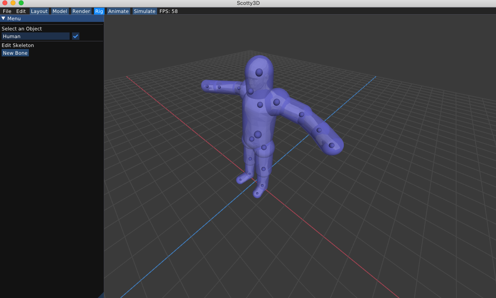

# Rig

### Rigging Setup

Select the `Rig` tab to create a skeletal rig for an object.

You can create new bone by first selecting a parent joint and pressing `New Bone`, then click anywhere else on the object to place the bone. From thereon, you can repeat this process to create a chain of bones connected along the selected joint.
If you want to branch off at a joint, simply click on the joint to branch off of, then start another chain by adding a new bone from there.

<video src="{{ site.baseurl }}/guide/rigging_mode/guide-rigging-1.mov" controls preload muted loop style="max-width: 100%; margin: 0 auto;"></video>

To view a rigged example, see `media/human.dae` example and select the object in the Rig tab to view its joints.
Once you've implemented forward kinematics the skeleton should be setup like so:

### Editing Skinning Weight Threshold Radius

Each joint has an associated `Radius`  which controls the part of the mesh influenced by the selected bone during animaton. The radius is visualized by the blue capsule around each bone and can be edited using the menu. The position of the joint can also be edited using the `Extent` values in the menu.

<video src="{{ site.baseurl }}/guide/rigging_mode/guide-rigging-2.mov" controls preload muted loop style="max-width: 100%; margin: 0 auto;"></video>

Note that rigging only uses extents of the bone for skeleton setup, joint pose does not influence the skeleton. Once rigging is done, the object can be posed by changing joint rotations in the [animate](../animate) mode. 

## Inverse Kinematics
Instead of computing the positions of the bones from the joint poses (forward kinematics), in inverse kinematics, joint positions are computed from target positions. 
To associate a target position with a joint, select `Add IK` and edit the target position. Multiple target positions can be associated with the same joint but targets need to be explicitly enabled using the checkbox.

In the [animate](../animate) mode, once inverse kinematics is implemented, joint rotation(pose) is updated based on the enabled IK handles.

<video src="{{ site.baseurl }}/guide/rigging_mode/guide-ik.mp4" controls preload muted loop style="max-width: 100%; margin: 0 auto;"></video>

